<style>
	.centrer {
		text-align: center;
	}

	img.centrerImg {
		display: block;
		margin: 0 auto;
	}
</style>

<h1 class="centrer">Portfolio</h1>
<p class="centrer">Jordi Rocafort | S4 - 2024-2025</p>
<p class="centrer" style="font-style: italic;">Bonne chance pour lire toutes les pages</p>

<h2 class="centrer">Rappel des compétences</h2>

- **Compétence 1** : Réaliser un développement d'application
	- **SP 1** : Élaborer une application informatique
	- **SP 2** : Faire évoluer une application informatique
	- **SP 3** : Maintenir en conditions opérationnelles une application informatique

	- **AC 1** : Implémenter des conceptions simples
	- **AC 2** : Élaborer des conceptions simples
	- **AC 3** : Faire des essais et évaluer leurs résultats en regard des spécifications
	- **AC 4** : Développer des interfaces utilisateurs
- **Compétence 2** : Optimiser des applications
	- **SP 1** : Améliorer les performances des programmes dans des contextes contraints
	- **SP 2** : Limiter l'impact environnemental d'une applications informatique
	- **SP 3** : Mettre en place des applications informatiques adaptées et innovantes

	- **AC 1** : Analyser un problème avec méthode
	- **AC 2** : Comparer des algorithmes pour des problèmes classiques
	- **AC 3** : Formaliser et mettre en œuvre des outils mathématiques pour l'informatique
- **Compétence 3** : Administrer des systèmes informatiques communicants complexes
	- **SP 1** : Déployer une nouvelle architecture technique
	- **SP 2** : Améliorer une infrastructure existante
	- **SP 3** : Sécuriser les applications et les services

	- **AC 1** : Identifier les différents composants d'un système numérique
	- **AC 2** : Utiliser les fonctionnalités de base d'un système multitâches / multiutilisateurs
	- **AC 3** : Installer et configurer un système d'exploitation et des outils de développement
	- **AC 4** : Configurer un poste de travail dans un réseau d'entreprise
- **Compétence 4** : Gérer des données de l'information
	- **SP 1** : Lancer un nouveau projet
	- **SP 2** : Sécuriser des données
	- **SP 3** : Exploiter des données pour la prise de décisions

	- **AC 1** : Mettre à jour et interroger une base de données relationnelle
	- **AC 2** : Visualiser des données
	- **AC 3** : Concevoir une base de données relationnelle à partir d'un cahier des charges
- **Compétence 5** : Conduire un projet
	- **SP 1** : Lancer un nouveau projet
	- **SP 2** : Piloter le maintien d'un projet en conditions opérationnelles
	- **SP 3** : Faire évoluer un système d'information

	- **AC 1** : Appréhender les besoins du client et de l'utilisateur
	- **AC 2** : Mettre en place les outils de gestion de projet
	- **AC 3** : Identifier les acteurs et les différentes phases d'un cycle de développement
- **Compétence 6** : Collaborer au sein d'une équipe informatique
	- **SP 1** : Lancer un nouveau projet
	- **SP 2** : Organiser son travail en relation avec celui de son équipe
	- **SP 3** : Élaborer, gérer et transmettre de l'information

	- **AC 1** : Appréhender l'écosystème numérique
	- **AC 2** : Découvrir les aptitudes requises selon les différents secteurs informatiques
	- **AC 3** : Identifier les status, les fonctions et les rôles de chaque membre d'une équipe pluridisciplinaire
	- **AC 4** : Acquérir les compétences interpersonnelles pour travailler en équipe

*AC : Apprentissage critique* et 
*SP : Situations professionnelles*

| Compétence | DACS        | IAMSI       | RACDV       |
|:----------:|:-----------:|:-----------:|:-----------:|
| C1         | **Majeure** | **Majeure** | **Majeure** |
| C2         | Mineure     | Mineure     | **Majeure** |
| C3         | **Majeure** | Mineure     | Mineure     |
| C4         | Mineure     | Mineure     | Mineure     |
| C5         | Mineure     | **Majeure** | Mineure     |
| C6         | **Majeure** | **Majeure** | **Majeure** |

---

<h2 class="centrer">Première Année</h2>

<p class="centrer" style="font-style: italic;">En raison d'un changement de PC et d'un premier portfolio peu rempli je n'ai plus certaines archives du premier semestre</p>

<h3 class="centrer">Premier Semestre</h3>

<h4 class="centrer">SAÉs</h4>

<h5 class="centrer">SAÉ 1.01 & 1.02 - Développement AKA 421</h5>

Les SAÉs 1.01 et 1.02 ont été réunies sous une SAÉ : le jeu du 421 qui se joue avec 3 dés et entre au moins 2 joueurs.

Elles étaient toutes les deux à réaliser en binôme.

La 1.01 portait sur la partie développement du jeu et mobilisait donc la compétence 1, elle était divisée en 3 livrables. Voici des extraits de code, plusieurs fonctions devaient être réalisées par nous-même

```java
public static void ordonnerResultat(int[] resultat) {
	// Il s'agit d'une implémentation de Bubble Sort
	// (certes c'est du O(n^2) mais pour 3 éléments ça va)
	int n = resultat.length;

	boolean ValeurEchangée;

	do {
		ValeurEchangée = false;

		for (int i = 0; i < (n - 1); i++) {
			if (resultat[i] > resultat[i + 1]) {
				echangerElementsTableau(resultat, i, i + 1);
				ValeurEchangée = true;
			}
		}

		n--;
	} while (ValeurEchangée);
}
```

```java
public static void genererFiguresEtPoints(int[][] figures, int[] pointsFigures) {
	int[][] figuresSpeciales = new int[][] {
		{ 3, 2, 1 }, { 4, 3, 2 }, { 5, 4, 3 }, { 6, 5, 4 },
		{ 2, 1, 1 }, { 2, 2, 2 }, { 3, 1, 1 }, { 3, 3, 3 },
		{ 4, 1, 1 }, { 4, 4, 4 }, { 5, 1, 1 }, { 5, 5, 5 },
		{ 6, 1, 1 }, { 6, 6, 6 }, { 1, 1, 1 }, { 4, 2, 1 }
	};

	int[] pointFiguresSpeciales = new int[] { 
		2, 2, 2, 2, 2, 2, 3, 3, 4, 4, 5, 5, 6, 6, 7, 11};

	int i = 0;

	for (int x1 = 1; x1 <= 6; x1++) {
		for (int x2 = 1; x2 <= x1; x2++) {
			for (int x3 = 1; x3 <= x2; x3++) {
				int[] r = new int[] { x1, x2, x3 };
				ordonnerResultatDec(r);

				if (!contientFigureTabFigures(r, figuresSpeciales)) {
					figures[i] = r;
					i++;
				}
			}
		}
	}

	for (int j = 0; j < figuresSpeciales.length; j++) {
		figures[i + j] = figuresSpeciales[j];
	}

	for (i = 0; i < figures.length; i++) {
		for (int j = 0; j < figuresSpeciales.length; j++) {
			if (figuresIdentiques(figures[i], figuresSpeciales[j])) {
				pointsFigures[i] = pointFiguresSpeciales[j];
			}
		}

		if (pointsFigures[i] == 0) {
			pointsFigures[i] = 1;
		}
	}
}
```


La SAE 1.02 portait quant à elle sur une étude mathématique du jeu, en particulier sur la comparaison d'algorithmes pour aborder le jeu. Elle mobilisait donc la compétence 2 avec notamment la R1.07 (Maths Discrètes).

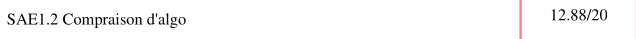

<h5 class="centrer">SAÉ 1.03 - Installation d'un poste</h5>

Au cours de cette SAÉ nous devions en binôme réaliser l'installation sur machine virtuelle ainsi qu'en dual boot d'une distribution linux de notre choix, notre choix s'était porté sur Linux Mint.

Cette SAÉ avait pour but de mobiliser la compétence 3 et s'associait à la R1.04 (Intro Systèmes) et la R1.10 (Anglais)

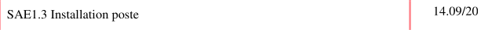

<h5 class="centrer">SAÉ 1.04 - Création d'une base de données</h5>

Pour cette SAÉ de BDD (R1.05) portant sur la compétence 4 nous étions par groupes de 4, nous entrions dans le rôle d'une entreprise qui construisait une base de données. Dans notre cas nous étions un studio de jeux vidéos, la base de données contenait donc des villes, des prix, des catégories, des employés et beaucoup d'autres informations.

Nous devions fournir un schéma Entité/Association, un jeu de données, des scripts de création des tables et de chargement des données, des questions formulées comme des exercices se basant à la fois sur notre schéma et sur notre jeu de données.

Nous devions aussi évaluer le rendu d'un autre groupe.


<h5 class="centrer">SAÉ 1.05 - Recueil de besoins</h5>

Pour cette SAÉ nous avions la tâche de recueillir les besoins d'une autre équipe dans l'optique de réaliser la communication autour d'un escape game dont ils ont choisi le thème.

Nous devions d'abord choisir parmi 5 propositions aléatoires qui nous étaient données via ChallengeMe. On les a évalué et ensuite on a choisi celle dont on allait faire la communication web, l'affiche/flyer ainsi que le pitch des énigmes.

Nous avions proposé un Escape Game sur le thème Star Trek mais je pense pas qu'un groupe en ai fait la communication.

On a choisi un Escape Game dans lequel un jet privé était détourné par des hackers qui allait faire s'écraser l'avion, il fallait donc s'échapper en sautant en parachute. Le sujet nous inspirait plus que les autres et avec mes connaissances de passionné de l'aéronautique je pouvais donc apporter des connaissances techniques aux épreuves. Déjà que l'équipe qui a eu l'idée du thème avait glissé quelques détails propres au domaine.

Cette SAÉ portait sur la compétence 5, la communication (R1.11) et le développement web (R1.02).

Voilà une capture d'écran du site. Malheureusement je n'ai plus le flyer.

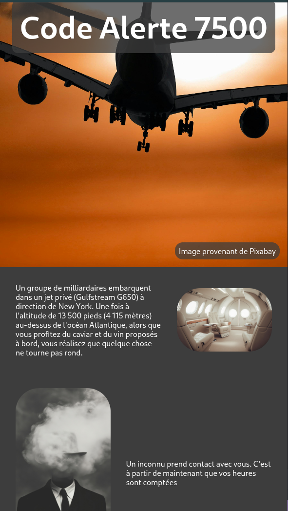

<br>

<p class="centrer">Voilà la note que j'ai eu à cette SAÉ</p>

<br>

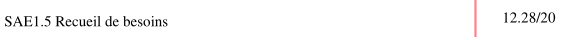

<h5 class="centrer">SAÉ 1.06 - Controverse</h5>

Il s'agit là de la SAÉ de communication (R1.11) elle combinait aussi l'économie durable et numérique (R1.09) et concernait la compétence 6, nous devions choisir une controverse liée aux algorithmes utilisant les statistiques pour influencer les choix

Dans notre cas c'était sur les décisions en Ressources Humaines et l'impact des décisions prises via ces algorithmes sur la vie des individus.

Nous devions réaliser un poster scientifique sur la controverse ainsi qu'un site web.

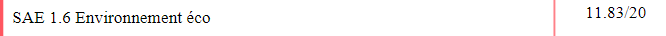

---

<h4 class="centrer">Les résultats du semestre</h4>

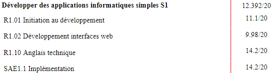

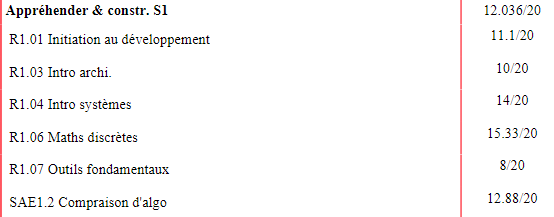

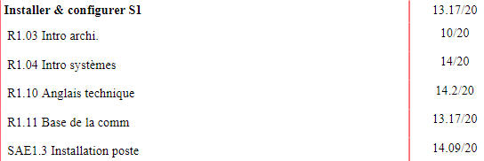

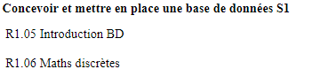
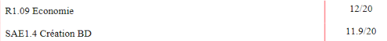

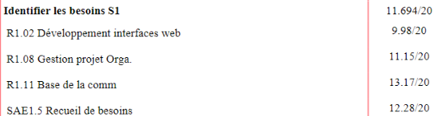

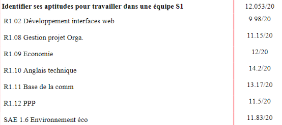

À la fin du semestre 1 je visais le parcours RACDV pour lequel les compétences majeures sont C1, C2 et C6.

Au vu de mes résultats dans mes compétences je m'en sortais partout mais c'était pas non plus formidable. Je devais donc améliorer mes notes mais dans l'ensemble ça allait.

---

<h3 class="centrer">Deuxième Semestre</h3>

<p class="centrer" style="font-style: italic">À la mi-février/début mars j'ai commencé une dépression/burnout, dès que je commençais à me pencher sur quoi que ce soit de lié aux cours je ne pouvais même plus mobiliser de connaissances</p>

<h4 class="centrer">SAÉs</h4>

<h5 class="centrer">SAÉ 2.01 - Pokémon TCG</h5>

La SAÉ Pokémon, dans cette SAÉ nous devions en binôme recoder le jeu de cartes Pokémon en implémentant une partie des règles et toutes les mécaniques du jeu.

L'interface graphique était fournie, il s'agissait d'un serveur web en local.

La SAÉ concernait le développement objet. À cette SAÉ on s'est ramassé : une belle note de **0/20**. En raison pour ma part de la dépression/burnout mentionnée plus haut, et pour mon binôme ce dernier ne voulant pas poursuivre le BUT il faisait preuve de relâchement (conscient ou non, ce n'est pas à moi de le dire). Et je passais aussi plus de temps à corriger des conflits de merge qu'à coder.

La deuxième phase de la SAÉ porte sur l'IHM, mais cette phase n'étant pas encore achevée il est difficile d'en dire quelque chose.

<h5 class="centrer">SAÉ 2.02 - Graphes</h5>

Elle porte sur une approche du Gymkhana sous forme de graphes

Elle n'est pas encore finie donc je ne peux pas en dire plus

<h5 class="centrer">SAÉ 2.03 - Installation de Services Réseau</h5>

Cette SAÉ porte sur le réseau (R2.05), elle se faisait en 3 rendus dont le dernier comprend une partie en Anglais.

Le premier rendu était la conception du réseau interne d'un espace de co-working, avec salle de réunion, open space, serveurs, administration/secrétariat, réseaux wifi et câblés. Nous devions donc réaliser un schéma de ce réseau, nous l'avons réalisé sur Filius et nous devions aussi penser à l'adressage IP, ce pour quoi mes cours de Terminale m'ont aidé afin de réaliser un adressage dimensionné pour être préparé à recevoir plus de machines dans le futur.

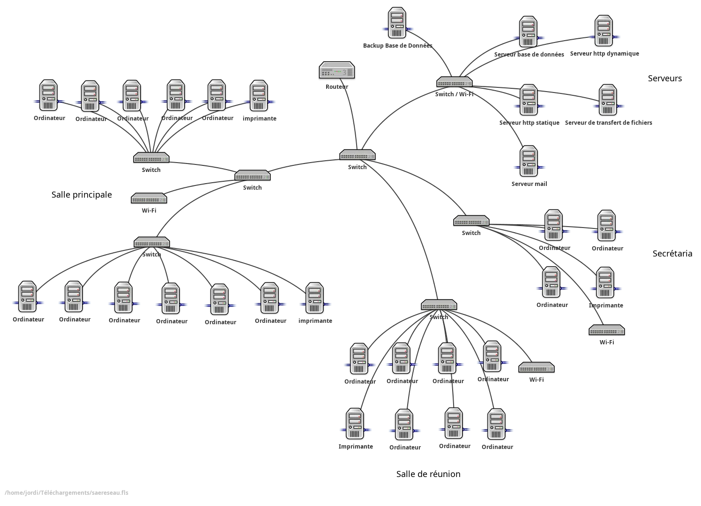

Et voici un exemple d'adressage IP, ici pour la salle des serveurs

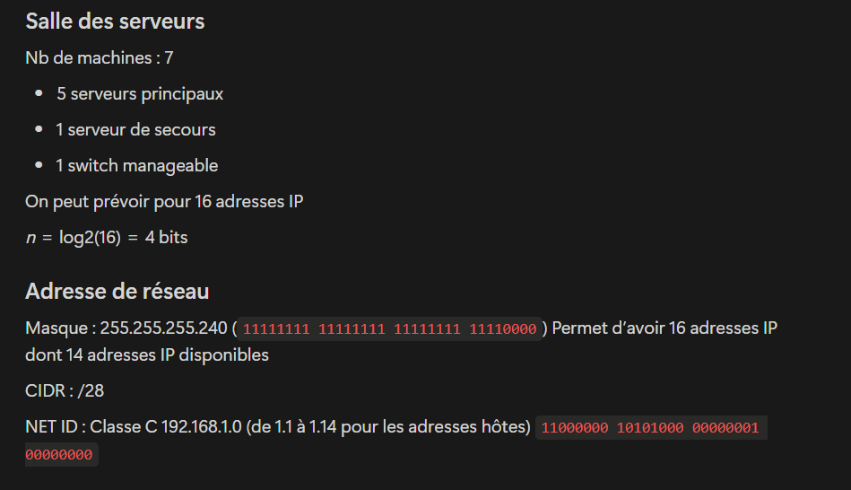

Le deuxième rendu portait sur le choix de serveur de base de données, serveur web, serveur mail et d'un système de backup ainsi que de la recherche sur différents protocoles utilisés.

Et le troisième et dernier rendu était l'installation d'un serveur de base de données, un serveur web, et de PHP + liaison du serveur Web avec PHP sur un serveur.

Nous avions décidé d'utiliser un de mes VPS afin de pouvoir travailler ensemble sur l'installation.

Nous avons mis une installation clean de Debian 12 sur le VPS, pour le serveur web on a choisi nginx, postgre pour la base de données et puis la dernière version dispo pour php sur apt pour debian 12, à savoir php 8.2.

L'url pour accéder est `sae.jordi-rocafort.fr` pour les curieux. Et pour ceux qui seraient encore plus curieux tous les ports sont bloqués sauf 80 et mon port SSH custom protégé par clé privée. Le VPS sera réinitialisé début juillet.

<h5 class="centrer">SAÉ 2.05 - Organisation d'évènement</h5>

Cette SAÉ nous a fortement hypé (comme souvent quand c'est M. Chollet derrière), il fallait réfléchir à l'organisation d'un évènement fictif quelconque sur un thème de notre choix, ça pouvait être un congrés, une convention, ou peu importe.

On devait faire une étude comptable du projet, choisir le lieu, planifier, faire des devis (seulement si ils sont automatisés, pour pas faire bosser des personnes pour rien), penser à la location du matériel, réfléchir au prix de vente des tickets.

Notre évènement portait sur le spatial.

<h5 class="centrer">SAÉ 2.06 - Application pour le Handi Sport</h5>

Dans cette SAÉ de Communication Technique nous avons réalisé en équipe de 4 le design Figma et le parcours utilisateur d'une application pour promouvoir les Handi Sport.

Pour parler de moi je laisse la parole à un des mes co-équipiers, enfin plutôt à l'appréciation qu'il a laissé (honnêtement vous pouvez skip ce pavé, mais merci Adrien pour ce long pavé de 2613 caractères).

```txt
Jordi a été un élément fort de notre groupe, sur ce projet. Il a été autonome sur la totalité de ses tâches, et a su répondre aux attentes. Le travail est de bonne qualité et répond aux consignes données. Il est structuré, bien rédigé et sans fautes majeures. Sur la phase de réflexion comme lors de tâches concrètes, Jordi a su donner un avis constructif et donner des idées d'une belle pertinence qui nous ont permis d'avancer sereinement en respectant à la fois nos délais et les consignes. Ensemble on a été capable d'identifier et de structurer le problème. Rassembler les informations nécessaires pour identifier les meilleures solutions applicables s'est donc avéré fluide avec lui. Il s'est montré proactif et volontaire pour aider les autres du groupe et apporter son expertise lorsqu'il le peut, en faisant preuve d'empathie et d'écoute active, et en étant volontaire pour expliquer et montrer comment faire, notamment sur la partie Figma. En effet, Jordi avait déjà une bonne connaissance du logiciel et nous a permis de rester efficace malgré le retard qu'on a pu prendre sur la deuxième phase du projet, à cause d'un manque de sessions de travail en groupe. Il était assigné comme moi sur le projet Figma et nous a permis de le fournir à temps pour la présentation. Cependant, une meilleure organisation des séances de travail sera appréciable pour la suite, car même si le retard a été rattrapé cette fois-ci, il se peut que ça lui porte préjudice pour la suite. Heureusement, il a été capable de formaliser la répartition des tâches dans le groupe et de l'adapter, avec nous, lorsque cela s'est montré nécessaire. Jordi a été un vecteur de bonne entente et de communication efficace durant notre travail, et ça nous a vraiment aidé. Il a fait preuve d'empathie vis-à-vis de domaine où nous étions moins bons, et de compréhension quant aux différents imprévus. Très calme, il a su réorganiser ses tâches et celles des autres pour faire avancer notre projet, plutôt que son travail personnel. L'échange avec lui a vraiment été plaisant et laisse entrevoir un point fort d'une grande force. 
La présentation orale s'est également bien déroulée, et Jordi a su combattre son stress pour rester clair, et présenter sa partie et notre projet avec sa fiabilité habituelle. 
Sa capacité à allier rigueur, écoute et sens de l’initiative a largement contribué à la réussite et à l'appréciation du projet. Il a rempli son rôle et a été un moteur constant pour le groupe. En somme, Jordi s’est imposé comme un coéquipier de grande valeur, aussi compétent qu’humain, et dont l’implication a été déterminante.
```

Et voici la preuve que ça vient de lui

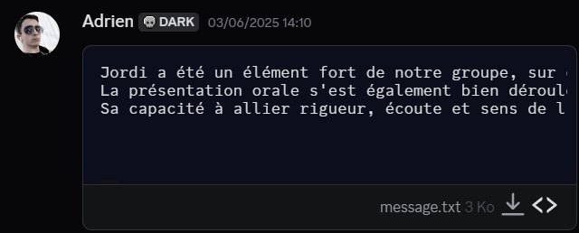

Le Figma de l'appli

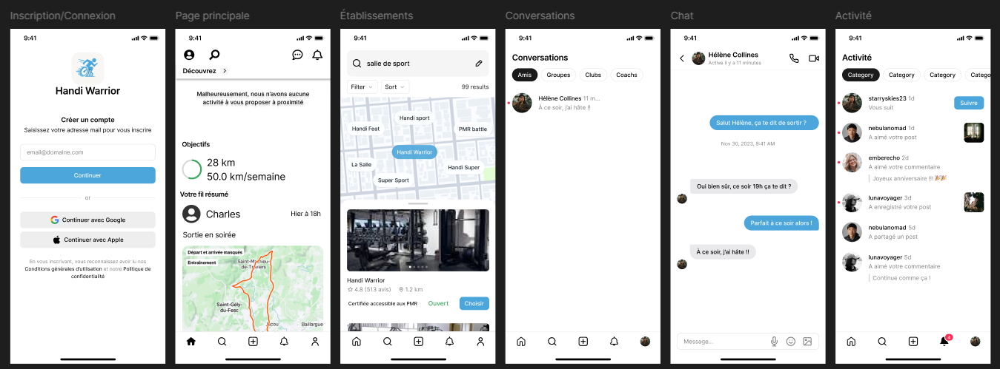

---

<h4 class="centrer">À côté des cours</h4>

<h5 class="centrer">Code Game Jam - 9ème édition</h5>

Fin Janvier s'est tenue la neuvième édition de la Code Game Jam organisée, le thème de cette édition était **Mélodie à l'infini**.

Avec Bastien, Clément et Romain (Team Yolo - Partie 2) nous avons développé le jeu "The Symphony Of Stars" en Java avec LibGDX, on a été maso sur ce coup-là. On a tiré notre inspiration de jeux comme Star Citizen (si on demande à Romain) et Elite Dangerous (si on me demande)

J'étais en charge de la mise en place des systèmes de coordonnées pour les planètes, des conversions entre ces derniers

J'ai donc travaillé sur les coordonnées absolues des étoiles dans l'espace, les coordonnées relatives au vaisseau (au joueur/caméra), les coordonnées dans la fenêtre ainsi que sur le calcul de la taille apparente de l'étoile en fonction de sa distance.

Voilà le code pour le calcul des coordonnées relatives au vaisseu
```java
public void reComputeRelativeCoords(AbsoluteCoords3D spaceshipCoords3d) {
	float[] Delta3D = spaceshipCoords3d.getDelta(this.coords3d);

	this.xRel = Delta3D[0];
	this.yRel = Delta3D[1];
	this.zRel = Delta3D[2];

	this.distance = (long)Math.sqrt(Ut.pow(xRel, 2.0f) + Ut.pow(yRel, 2.0f) + Ut.pow(zRel, 2.0f)); // Distance de l'étoile au vaisseau

	if (distance != 0) {
		this.lat = (float)Math.asin(zRel / (float)distance);
		this.lng = (float)Math.atan2(yRel / (float)distance, xRel / (float)distance);
	} else {
		this.lat = 0;
		this.lng = 0;
	}
}
```

Pour les coordonnées dans le champ de vision
```java
public void reComputeFOVCoords(SpaceshipRelative objRelativeCoords) {
	float DeltaLat, DeltaLng;

	float[] objCoords = objRelativeCoords.getLatLong();
	float[] fovCoords = this.FOV.getCenterCoords();
	float[] fovAngles = this.FOV.getFovAngles();

	float fovX, fovY;

	fovX = fovAngles[0];
	fovY = fovAngles[1];

	DeltaLat = objCoords[0] - fovCoords[0];
	DeltaLng = objCoords[1] - fovCoords[1];

	this.isVisible = ((fovCoords[0] + fovX / 2.f) >= objCoords[0]) && (objCoords[0] >= (fovCoords[0] - fovX / 2.f)) &&
					 ((fovCoords[1] + fovY / 2.f) >= objCoords[1]) && (objCoords[1] >= (fovCoords[1] - fovY / 2.f));

	if (this.isVisible) {
		this.X = DeltaLng;
		this.Y = DeltaLat;

		this.normalisedX = X / (0.5f * fovX);
		this.normalisedY = Y / (0.5f * fovY);
	}
}
```

Voilà un exemple de code qui est fonctionnel, mais est mal écrit juste parce que je l'ai fait à presque minuit, j'avais la flemme de transformer `otherCoords[0] - this.x` en `this.x - otherCoords[0]` donc j'ai juste changé les signes. Il est quand même important de se critiquer parfois, voilà donc un exemple.

```java
public float[] getDelta(AbsoluteCoords3D other) {
	float DeltaX, DeltaY, DeltaZ;
	float[] otherCoords = other.getCoords();

	DeltaX = - otherCoords[0] + this.x;
	DeltaY = - otherCoords[1] + this.y;
	DeltaZ = - otherCoords[2] + this.z;

	return new float[]{DeltaX, DeltaY, DeltaZ};
}
```

J'ai aussi fait la skybox (image statique faite en deux minutes sur Paint.NET en jouant avec les fonctionnalités de bruit et en jouant sur les curseurs de contraste/luminosité).

<h6 class="centrer">Screenshots du jeu :</h6>

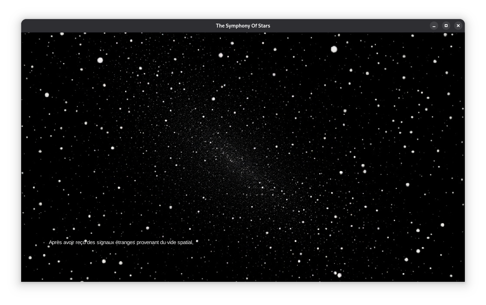
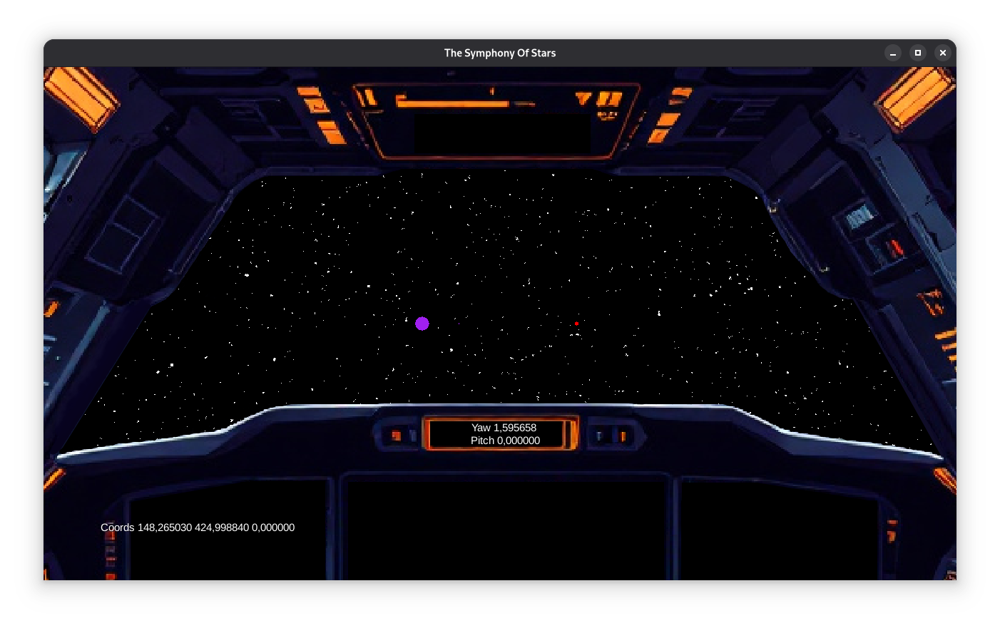

*J'ai adoré cette édition, j'ai tellement adoré que j'ai en quelques sortes rempli des rôles diplomatiques avec l'équipe de l'IUT de Calais.*

Après la Game Jam j'ai fork le projet sur mon GitHub perso, d'autres membres de l'équipe voulaient continuer de le modifier dans leur coin, j'ai donc fait ce fork pour archiver.

Voici le lien vers le [dépôt github](https://github.com/Jordi-R66/CodeGameJam2025-Continued). Vous pouvez aussi le télécharger depuis le [site officiel de la CGJ](https://cgj.bpaul.fr/vote/publicView).

Nous avons caché un easter egg en l'honneur de M. Chollet, il faut trouver une certaine étoile rose et une musique se jouera, si vous n'arrivez pas à la jouer vous pouvez aller dans l'écran des crédits, la musique se déclenchera automatiquement (merci à Clément et Naïs pour avoir généré cette musique avec l'IA il y a un an).

<h4 class="centrer">Résultats du semestre</h4>

Mes résultats ont pris un sale coup à cause de ma dépression

POO    : 6.20 de moyenne
En IHM : 7.25 de moyenne sur les interros
UE 1 et 2 : 6.20
Compta : 7, 9 et 5

PPP : 
 - Lettre entretien : 17.25
 - Questionnaire entretien : 13.50
 - Analyse entretien : 0.00
 - Synthèse Recherche Doc : 14
 - Oral Final : 14

Contrôle méthodes numériques : 7.5/20

Exam d'anglais du 10 Juin : 17.50/20

Au cours du deuxième semestre après avoir parlé avec des A2 et A3 je suis arrivé à la conclusion que finalement je ne partirai pas en RACDV mais en DACS parce que le dév web est sans doute le domaine du dév que je déteste le plus et en RACDV on bouffe énormément de web. Cette conclusion a l'avantage de me rapprocher de ce qui m'a fait entrer dans l'informatique : la cyberséc, mon premier Linux étant un Kali Linux installé en VM en 2017 et ensuite je m'amusais à faire des trucs de script kiddy (faut bien commencer quelque part).

Même si je veux toujours faire du dév d'applis et logiciels, je préfère continuer en DACS parce que le web n'y a pas autant d'importance qu'en RACDV et puis je compenserai ce que je n'apprendrai pas grâce à l'apprentissage en autodidacte, comme je fais depuis 2018. J'aime aussi pas mal le C et le réseau (en informatique je suis assez touche à tout) donc le choix de partir en DACS a du sens.

**MAIS**, ça c'est seulement si l'on accepte mon passage en deuxième année, mais au vu des notes de ce semestre, ça risque d'être compliqué.

Rien que les notes sur les 2 premières UE (ou compétences, c'est la même chose) j'ai une moyenne retenue pour l'année d'environ 9. Mais honnêtement si je dois redoubler alors je redoublerai, ça me dérange pas de refaire une année.

Mon classement par ordre de préférence tel que communiqué à l'IUT est le suivant

1. DACS
2. RACDV
3. IAMSI

Mais en réalité on serait plutôt sur

1. DACS
2. RACDV
3. REDOUBLER
4. IAMSI

Et j'hésite à swap 2 et 3. Dans tous les cas, déso les IAMSI